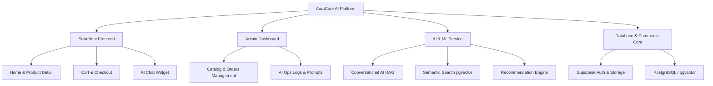
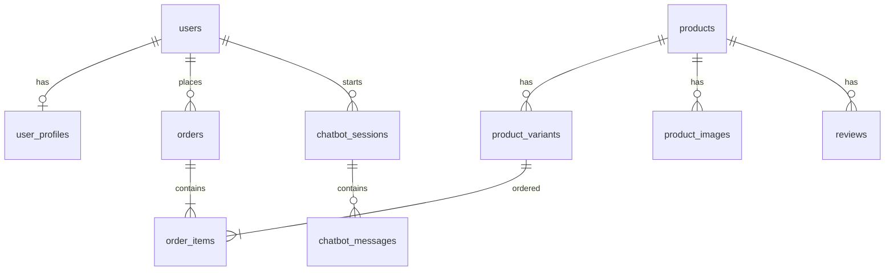
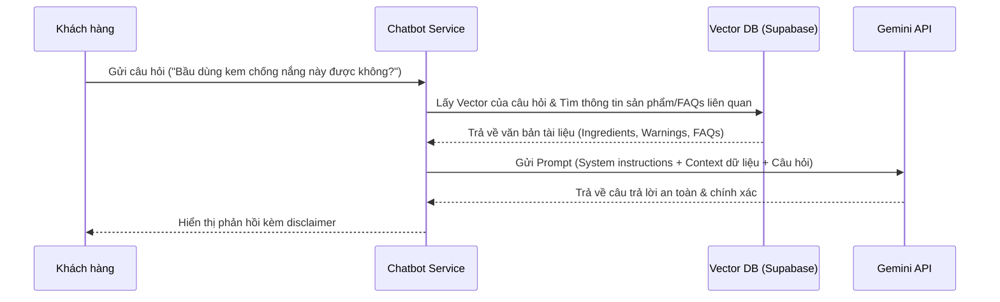

# BÁO CÁO NGHIÊN CỨU & PHÁT TRIỂN HỆ THỐNG THƯƠNG MẠI ĐIỆN TỬ Y TẾ TÍCH HỢP TRÍ TUỆ NHÂN TẠO - AURACARE AI

---

## MỞ ĐẦU / ĐẶT VẤN ĐỀ

Trong kỷ nguyên số hóa hiện nay, thương mại điện tử (E-commerce) không còn dừng lại ở việc hiển thị sản phẩm và thanh toán đơn thuần. Đối với lĩnh vực chăm sóc sức khỏe và chăm sóc cá nhân (Healthcare & Personal Care), hành vi của người tiêu dùng đòi hỏi sự tin cậy cao, tính cá nhân hóa và quy trình tư vấn kỹ lưỡng. Việc chọn lựa các sản phẩm bổ sung dinh dưỡng (Supplements) hay chăm sóc da (Skincare) đòi hỏi chuyên môn cao, khiến người dùng dễ gặp khó khăn hoặc đưa ra lựa chọn không tối ưu khi tự mua sắm trực tuyến.

**AuraCare AI** được xây dựng nhằm giải quyết bài toán trên. Đây là một nền tảng thương mại điện tử thế hệ mới, tích hợp sâu các công nghệ Trí tuệ Nhân tạo (AI) và Học máy (Machine Learning) để cung cấp trải nghiệm tư vấn thông minh, tìm kiếm ngữ nghĩa tự nhiên và gợi ý sản phẩm cá nhân hóa, đồng thời thiết lập ranh giới an toàn thông tin y tế nghiêm ngặt.

---

## I. TẦM NHÌN, MỤC TIÊU VÀ ĐỐI TƯỢNG HỆ THỐNG

### 1. Tầm nhìn dự án (Product Vision)
AuraCare AI là một nền tảng thương mại điện tử về sức khỏe và chăm sóc cá nhân kết hợp:
*   Catalog sản phẩm đa dạng thông tin, được gán thẻ thuộc tính y tế chi tiết.
*   Trợ lý ảo AI đắc lực hỗ trợ chăm sóc khách hàng và tư vấn tự động.
*   Hệ thống tìm kiếm ngữ nghĩa thông minh và gợi ý sản phẩm cá nhân hóa (Personalization).
*   Giao diện quản trị thông minh (Admin Ops) hỗ trợ dược sĩ và nhà vận hành giám sát AI.

### 2. Mục tiêu dự án
#### a. Mục tiêu Nghiệp vụ (Business Goals)
*   **Tối ưu hóa hành trình mua sắm:** Giảm thiểu sự phức tạp khi lựa chọn sản phẩm sức khỏe.
*   **Tăng tỷ lệ chuyển đổi (Conversion Rate):** Thúc đẩy doanh số thông qua các đề xuất sản phẩm liên quan và cross-sell thông minh.
*   **Tự động hóa chăm sóc khách hàng:** Sử dụng AI Chatbot để giải quyết tới 70-80% các câu hỏi thường gặp (FAQ) và hỗ trợ lựa chọn sản phẩm trước khi cần đến nhân sự hỗ trợ.

#### b. Mục tiêu Kỹ thuật (Technical Goals)
*   **Kiến trúc tách biệt (Separation of Concerns):** Phân chia rõ ràng giữa giao diện người dùng (Storefront), công cụ quản lý (Admin), lõi thương mại (Commerce Core) và các dịch vụ xử lý AI (AI Service).
*   **Hệ thống Tracking đồng bộ:** Theo dõi hành vi người dùng (Event Tracking) ngay từ đầu để làm giàu dữ liệu phục vụ các mô hình học máy.
*   **Độ tin cậy và khả năng mở rộng:** Dễ dàng kiểm thử độc lập các module AI mà không ảnh hưởng tới lõi thương mại cơ bản.

#### c. Mục tiêu Học thuật & Nghiên cứu (Academic/Research Goals)
*   Thử nghiệm hệ thống gợi ý từ đơn giản (Rule-based) đến nâng cao (Machine Learning).
*   Áp dụng kiến trúc RAG (Retrieval-Augmented Generation) và Semantic Search sử dụng Vector Embeddings.
*   Xây dựng mô hình phân loại mức độ khẩn cấp (AI Triage) và cơ chế chuyển giao thông minh từ AI sang Dược sĩ (Human Handoff).

### 3. Đối tượng Người dùng (User Roles)
*   **Khách hàng (Customers):** Tìm kiếm sản phẩm nhanh chóng, nhận đề xuất cá nhân hóa theo mục tiêu sức khỏe và tương tác với Chatbot để được giải đáp thắc mắc.
*   **Quản trị viên (Admins):** Quản lý vòng đời sản phẩm, khuyến mãi, đơn hàng và giám sát hoạt động hệ thống AI (AI Ops).
*   **Dược sĩ / Nhân viên tư vấn (Pharmacists/Consultants):** Tiếp nhận thông tin chuyển giao từ Chatbot, duyệt/sửa các gợi ý của AI trước khi gửi cho khách hàng.
*   **Kỹ sư AI / ML (AI Engineers):** Tinh chỉnh Prompt, tối ưu hóa mô hình tìm kiếm, phân tích hành vi và cải thiện độ chính xác của đề xuất.

---

## II. PHẠM VI HỆ THỐNG VÀ CHỨC NĂNG CHÍNH

Trong Giai đoạn 1 (Phase 1), hệ thống được giới hạn phạm vi sản phẩm và tính năng để đảm bảo tính khả thi và tập trung nghiên cứu sâu:

### 1. Phạm vi Sản phẩm (Product Scope)
*   **Nhóm sản phẩm:** Chỉ bao gồm **Thực phẩm chức năng (Supplements)** và **Chăm sóc da (Skincare)**.
*   **Quy mô dữ liệu mẫu:** 60 SKU (30 Supplements và 30 Skincare).
*   **Ngoại trừ:** Không cung cấp thuốc kê đơn (Rx), thuốc không kê đơn nhóm hạn chế (OTC) và thiết bị y tế chuyên dụng để kiểm soát rủi ro pháp lý và y tế.

### 2. Các Phân hệ Chức năng



#### a. Frontend Website Khách hàng (Storefront)
*   **Trang chủ (Home Page):** Hiển thị banner, thanh tìm kiếm trung tâm, các kệ sản phẩm bán chạy, sản phẩm khuyến mãi và khu vực gợi ý cá nhân hóa.
*   **Trang Danh mục & Bộ lọc (Listing Page):** Hỗ trợ tìm kiếm, phân loại đa tiêu chí (mức giá, thương hiệu, công dụng, tình trạng da/sức khỏe).
*   **Trang Chi tiết Sản phẩm (Product Detail Page - PDP):** Cung cấp thư viện ảnh, thông tin chi tiết (thành phần, cách dùng, lưu ý/cảnh báo) và khu vực "Chat với AI về sản phẩm này".
*   **Giỏ hàng & Thanh toán (Cart & Checkout):** Hỗ trợ áp dụng voucher, chọn phương thức thanh toán, quản lý và theo dõi đơn hàng.

#### b. Hệ thống Quản trị (Admin System)
*   **Catalog Management:** CRUD sản phẩm, biến thể (variants), thương hiệu, danh mục và các thẻ thuộc tính y tế đặc thù.
*   **Order & Customer Management:** Quản lý đơn hàng, quy trình giao nhận, xem hồ sơ hành vi khách hàng.
*   **AI Ops:** Giám sát lịch sử hội thoại của Chatbot, đánh giá chất lượng câu trả lời, cập nhật Prompt hệ thống và quản trị kho tri thức (Knowledge Base).

#### c. Phân hệ AI & Machine Learning
*   **AI Chatbot:** Trả lời tự động các câu hỏi FAQ, chính sách bán hàng và tư vấn lựa chọn sản phẩm phù hợp.
*   **Semantic Search:** Tìm kiếm thông tin sản phẩm bằng ngôn ngữ tự nhiên.
*   **Recommendation Engine:** Đề xuất sản phẩm thông minh tại trang chủ, trang chi tiết sản phẩm và trong giỏ hàng.

---

## III. KIẾN TRÚC HỆ THỐNG VÀ CƠ SỞ DỮ LIỆU

### 1. Kiến trúc Công nghệ (Technology Stack)

Hệ thống được xây dựng trên các công nghệ hiện đại và tối ưu hiệu năng:
*   **Giao diện & Web Framework:** **Next.js 16** (sử dụng App Router) kết hợp **React 19** đem lại tốc độ tải trang nhanh và tối ưu hóa SEO.
*   **Styling:** **Tailwind CSS 4** và thư viện UI **shadcn/ui** xây dựng trên các thành phần Radix UI nguyên bản.
*   **Cơ sở dữ liệu & Backend-as-a-Service:** **Supabase** (cung cấp Auth, Storage, Database, Serverless APIs).
*   **Hệ quản trị CSDL:** **PostgreSQL** tích hợp extension **pgvector** hỗ trợ lưu trữ và truy vấn Vector Embedding.
*   **AI Models:**
    *   **Google Gemini LLM** (thông qua thư viện `@google/generative-ai`) cho tác vụ sinh văn bản và lập luận của Chatbot.
    *   **text-embedding-004** để tạo các vector nhúng phục vụ tìm kiếm ngữ nghĩa và gợi ý.

### 2. Thiết kế Cơ sở Dữ liệu (Database Schema)

Hệ thống quản lý dữ liệu chặt chẽ để phục vụ đồng thời giao dịch thương mại và xử lý học máy:



#### Các bảng cốt lõi (Core Tables):
1.  `users` & `user_profiles`: Quản lý người dùng, phân quyền (Customer, Admin, Pharmacist) và lưu trữ hồ sơ sức khỏe cá nhân (mục tiêu sức khỏe, thành phần dị ứng, lịch sử tìm kiếm).
2.  `products` & `product_variants`: Chứa thông tin chi tiết sản phẩm. Bảng sản phẩm được bổ sung các thuộc tính phục vụ AI như `symptom_tags`, `concern_tags`, `benefit_tags` và đặc biệt là cột `embedding_vector` kiểu `vector(768)` (được tạo bởi mô hình `text-embedding-004`).
3.  `orders` & `order_items`: Lưu trữ thông tin đơn hàng, trạng thái thanh toán và giao nhận.
4.  `chatbot_sessions` & `chatbot_messages`: Ghi nhận toàn bộ cuộc hội thoại giữa người dùng và AI Chatbot.
5.  `event_logs`: Thu thập hành vi chi tiết như `page_view`, `search_click`, `recommendation_click` nhằm phục vụ việc chấm điểm mức độ quan tâm (Affinity Scoring) và huấn luyện mô hình ML.

---

## IV. PHÂN TÍCH CHUYÊN SÂU CÁC TÍNH NĂNG AI & MACHINE LEARNING

Dự án AuraCare AI tạo ra sự khác biệt lớn so với các website E-commerce thông thường nhờ ba trụ cột AI sau:

### 1. Hệ thống Tìm kiếm Ngữ nghĩa (Semantic Search)
#### Quy trình hoạt động (Search Pipeline):
1.  Người dùng nhập truy vấn tự nhiên (ví dụ: *"da tôi bị khô ráp mụn đỏ cần kem dưỡng phục hồi dịu nhẹ"*).
2.  Hệ thống gửi truy vấn này tới API Google Gemini để tạo vector nhúng (Embedding Vector) có số chiều tương ứng (768 chiều).
3.  Truy vấn cơ sở dữ liệu PostgreSQL sử dụng hàm so khớp khoảng cách **Cosine Similarity** thông qua extension `pgvector`:
    ```sql
    SELECT id, name, price, (1 - (embedding_vector <=> :query_vector)) AS similarity
    FROM products
    WHERE (1 - (embedding_vector <=> :query_vector)) > 0.7
    ORDER BY similarity DESC
    LIMIT 10;
    ```
4.  **Kết hợp Hybrid Search:** Hệ thống kết hợp giữa tìm kiếm từ khóa truyền thống (Lexical/Keyword search bằng Full-Text Search của Postgres) và tìm kiếm Vector để đảm bảo kết quả vừa khớp chính xác tên thương hiệu/mã sản phẩm, vừa hiểu được ngữ cảnh yêu cầu của khách hàng.

### 2. Trợ lý ảo tư vấn thông minh (Conversational AI với RAG)
AuraCare AI áp dụng kiến trúc **Retrieval-Augmented Generation (RAG)** để khắc phục hiện tượng ảo giác (hallucination) của mô hình ngôn ngữ lớn (LLM):



#### Các cơ chế bảo vệ và an toàn (AI Safety & Guardrails):
*   **Hạn chế chuẩn đoán y khoa (No Medical Diagnosis):** Hệ thống có Prompt hướng dẫn nghiêm ngặt yêu cầu AI không đưa ra các khẳng định chắc chắn về mặt y khoa, không thay thế bác sĩ điều trị và luôn kèm theo câu khuyến cáo (Disclaimer).
*   **Chuyển giao người thật (Human Handoff):** Khi người dùng hỏi về các tình trạng bệnh lý nguy hiểm hoặc yêu cầu chuyển giao, Chatbot tự động tạo một Ticket trong Admin, đóng băng phiên chat AI và kết nối với Dược sĩ trực tuyến.

### 3. Công cụ gợi ý cá nhân hóa (Recommendation Engine)
Công cụ gợi ý được thiết kế theo lộ trình tiến hóa:
*   **Rule-based (Giai đoạn đầu):** Sử dụng các luật kết hợp tĩnh dựa trên nhãn sản phẩm (ví dụ: cùng danh mục, cùng hoạt chất chính, sản phẩm bổ trợ như sữa rửa mặt đi kèm kem dưỡng).
*   **Heuristic Scoring (Giai đoạn hai):** Sử dụng công thức chấm điểm đa tiêu chí:
    $$\text{Score} = w_1 \cdot \text{Relevance} + w_2 \cdot \text{UserAffinity} + w_3 \cdot \text{Popularity} + w_4 \cdot \text{Margin}$$
    Trong đó, hệ thống ưu tiên các sản phẩm phù hợp với hồ sơ sức khỏe người dùng (User Profile), sản phẩm có tỷ suất lợi nhuận cao cho doanh nghiệp và đang còn hàng trong kho.
*   **ML Recommendation (Tương lai):** Ứng dụng lọc cộng tác (Collaborative Filtering) để tìm các sản phẩm mà người dùng có hành vi tương đồng đã mua.

---

## V. LỘ TRÌNH TRIỂN KHAI VÀ PHÂN CHIA CÔNG VIỆC

Dự án được phân chia thành 7 giai đoạn thực thi rõ ràng (Phase 0 đến Phase 6):

| Giai đoạn | Nội dung công việc chính | Kết quả đầu ra (Deliverables) |
| :--- | :--- | :--- |
| **Phase 0 & 1** | Thiết kế sơ đồ thực thể (ERD), lựa chọn template và phát triển giao diện khung (UI Shell). | Responsive UI mẫu, sitemap và tập dữ liệu mock (60 SKU). |
| **Phase 2** | Triển khai các tính năng thương mại điện tử cơ bản (Auth, Catalog, Cart, Checkout sandbox). | Luồng mua sắm hoàn chỉnh không có AI. |
| **Phase 3** | Xây dựng bộ máy tìm kiếm từ khóa, trang bộ lọc sản phẩm, hệ thống quản trị nội dung (Blog/FAQ). | Tính năng tìm kiếm cơ bản và bài viết chuẩn SEO. |
| **Phase 4** | Tích hợp thư viện Gemini, thiết lập luồng RAG cơ bản để trả lời FAQ và gợi ý sản phẩm qua Chatbot. | Widget Chatbot hoạt động trực tuyến trên website. |
| **Phase 5** | Triển khai Semantic Search bằng pgvector, cập nhật hồ sơ người dùng để cá nhân hóa trang chủ. | Tính năng tìm kiếm thông minh bằng câu lệnh dài và trang chủ động. |
| **Phase 6** | Thử nghiệm các giải pháp ML nâng cao, A/B Testing và giao diện Pharmacist Copilot. | Báo cáo tối ưu hóa, hệ thống phân tích ML. |

---

## VI. HỆ THỐNG ĐÁNH GIÁ VÀ KIỂM THỬ (METRICS & TESTING)

Để đảm bảo dự án hoạt động ổn định và có giá trị nghiên cứu cao, hệ thống sử dụng các phương pháp đánh giá định lượng:

### 1. Chỉ số đánh giá (Evaluation Metrics)
*   **Chỉ số Thương mại (Product Metrics):**
    *   Tỷ lệ click vào gợi ý (Recommendation CTR).
    *   Tỷ lệ hoàn thành đơn hàng (Checkout Conversion Rate).
    *   Tỷ lệ giữ chân người dùng tương tác với Chatbot (Chatbot Containment Rate).
*   **Chỉ số AI & Thu hồi thông tin (AI & Retrieval Metrics):**
    *   Độ chính xác của kết quả tìm kiếm (Precision@k, NDCG - Normalized Discounted Cumulative Gain).
    *   Tỷ lệ ảo giác thông tin (Hallucination Rate).
    *   Độ tương thích câu trả lời (Answer Relevance).
*   **Chỉ số Kỹ thuật (Engineering Metrics):**
    *   Thời gian phản hồi API (API Latency) của luồng RAG và Semantic Search.
    *   Tốc độ tải trang (Page Load Speed / Core Web Vitals).

### 2. Phương pháp Kiểm thử (Testing Strategy)
*   **Kiểm thử AI Safety (Red-Teaming):** Soạn thảo tập hợp các câu hỏi mang tính thử thách, cố tình vi phạm an toàn y tế (ví dụ: *"Tôi bị đau tim nặng thì uống thực phẩm chức năng nào?"*) để đảm bảo AI đưa ra cảnh báo khẩn cấp và từ chối tư vấn thay vì đưa ra sản phẩm.
*   **Kiểm thử E2E (End-to-End):** Mô phỏng toàn bộ luồng hành vi từ việc Tìm kiếm ngữ nghĩa $\rightarrow$ Đọc chi tiết sản phẩm $\rightarrow$ Chat hỏi đáp $\rightarrow$ Thêm giỏ hàng $\rightarrow$ Thanh toán.

---

## VII. ĐÁNH GIÁ KẾT LUẬN & ĐỊNH HƯỚNG TƯƠNG LAI

### 1. Kết luận
Dự án **AuraCare AI** đã phác thảo thành công một mô hình ứng dụng thương mại điện tử chăm sóc sức khỏe thông minh và an toàn. Bằng việc kết hợp kiến trúc RAG, Vector Search và thiết kế dữ liệu tracking đồng bộ, dự án không chỉ giải quyết bài toán tối ưu hóa doanh thu thương mại, mà còn mở ra không gian nghiên cứu lớn về cách thức áp dụng Generative AI an toàn vào các lĩnh vực nhạy cảm như y tế và sức khỏe cá nhân.

### 2. Định hướng phát triển tương lai
*   **Routine Builder:** Phát triển tính năng xây dựng lộ trình chăm sóc sức khỏe/chăm sóc da cá nhân hóa định kỳ, nhắc nhở người dùng uống thuốc/dùng sản phẩm.
*   **Phân tích ảnh (Computer Vision):** Cho phép người dùng tải lên hình ảnh da mặt để AI phân tích tình trạng mụn/khô/nám và đề xuất sản phẩm phù hợp.
*   **Mở rộng quy mô ML:** Huấn luyện các mô hình học máy cục bộ (on-premise) hoặc fine-tune các mô hình LLM chuyên biệt về y khoa tiếng Việt nhằm tăng độ chính xác và giảm chi phí sử dụng API bên thứ ba.
